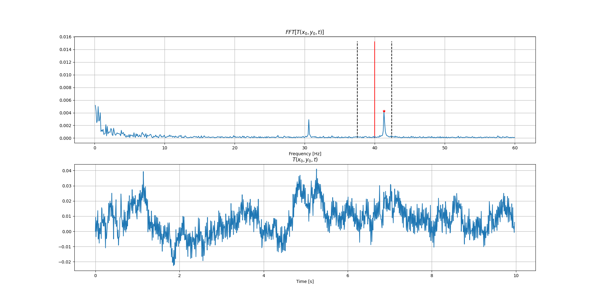
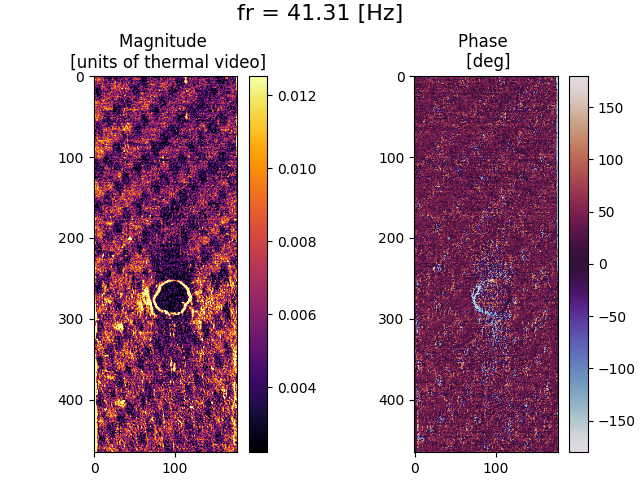

Thermoelastic Stress Analysis (TSA)
---------------------------------------------

Perform interactive frequency-based analysis for thermal acquisition and data visualization: digital lock-in and real-frequency reconstruction using FFT approach 

The reference signal is reconstruct digitaly, so need the frequency and the phase. The real frequency for the load can be different from the frequency set in the load/acquistion sistem. The digital signal may be out of phase with the infrared response and this will produce an apparent phase shift in the recorde thermoelastic signal.The "freq_detection" method try to reconstruction the reference signal from the thermal video, without the need of acquisiton.

Installing this package
-----------------------

If you have the script and pytsa module in the same folder, use `import` to use it by:

.. code-block:: python

   import sys 

If the module is in another folder, you can use :

.. code-block:: python

   sys.path.insert(0, '/path/to/application/app/folder')
   import pytsa

    
Simple examples
---------------

Here is a simple example on how to use the code:

.. code-block:: python

   fs = 120 # Sampling rate [Hz]
   path = 'video.npy'
   analysis = pytsa.TSA(fa,path)
   fr = 40 # load frequency [Hz]
   analysis.freq_detection(fr,cordinate[0],cordinate[1],cordinate[2],cordinate[3],view=True)
   analysis.lockin()
   analysis.view_result()

Other examples are included (`base.py <https://github.com/LolloCappo/Thermoelasticity-Interactive-Analysis/tree/main/Esempi>`_) 
